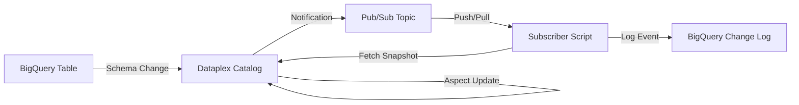

# Walkthrough: Real-time Metadata Change Capture

This solution implements an event-driven mechanism to capture and log Dataplex metadata changes into BigQuery. It enables audit trails, real-time alerts, and conversational analysis of technical and business metadata changes.

## Overview

The system monitors changes in Dataplex (schema updates, aspect changes) and automatically logs them into a central BigQuery table with a full metadata snapshot at the time of the event.



## Components

1.  **Metadata Change Feed**: A Dataplex resource that monitors metadata changes and publishes to Pub/Sub.
2.  **Pub/Sub Topic**: `dataplex-metadata-changes` handles the asynchronous event stream.
3.  **Subscriber**: `metadata_change_subscriber.py` processes messages, fetches the current state, and logs to BigQuery.
4.  **Logging Table**: `governance_export.metadata_changes` stores the event history with **actor identification** via Cloud Audit Logs correlation.

## Identity Tracking

The system automatically identifies the user who performed the change by correlating Pub/Sub events with Cloud Audit Logs. This helps distinguish between:
- **Human Changes**: (e.g., `admin@your-org.com`) made via the Dataplex UI or Cloud Console.
- **System Actions**: (e.g., `system-harvest`) performed by automated background processes.

## Verification Results

I have verified the system with several types of triggers:

### 1. Schema Change (Native BigQuery)
- **Action**: Added `migration_flag` column to the `customers` table.
- **Result**: Dataplex detected the schema change and the subscriber correlated the audit log.
- **Log Entry**:
    - **User**: `your-user@example.com`
    - **Change Type**: `UPDATE`
    - **Summary**: `Metadata UPDATE for customers (Aspects: schema, ...)`

### 2. Aspect Change (Dataplex Catalog)
- **Action**: Updated the `owner` field in the `data-governance-aspect` via Dataplex UI.
- **Result**: Immediate notification with actor attribution.
- **Log Entry**:
    - **User**: `your-user@example.com`
    - **Change Type**: `UPDATE`
    - **Snapshot**: Contains the updated `owner` value.

## How to Run

### Configuration
Ensure the `GOOGLE_CLOUD_PROJECT` environment variable is set. Other variables (Location, Dataset) have sensible defaults but can be overridden.
```bash
export GOOGLE_CLOUD_PROJECT="your-project-id"
# Optional: export DATAPLEX_LOCATION="us-central1"
```

### Setup Infrastructure
```bash
source .venv/bin/activate
python3 dataplex_integration/setup_metadata_feed.py
```

### Start the Subscriber
```bash
source .venv/bin/activate
python3 dataplex_integration/metadata_change_subscriber.py
```

### Trigger Examples
```bash
# In a separate terminal
export GOOGLE_CLOUD_PROJECT="your-project-id"
python3 dataplex_integration/trigger_schema_change.py
python3 dataplex_integration/trigger_aspect_change.py
```

### Query Results
```sql
SELECT event_timestamp, user_email, change_type, summary 
FROM `governance_export.metadata_changes` 
ORDER BY event_timestamp DESC 
LIMIT 10;
```

## Metadata Evolution Visualization

I've implemented a new visualization layer to show how metadata evolves over time, specifically for business users to track schema changes and aspect associations.

### 1. Data Processing View
Created a BigQuery view `metadata_evolution` that flattens snapshots for easier consumption:
- [metadata_evolution_view.sql](file:///Users/akankshapb/work/governance-agent/dataplex_integration/metadata_evolution_view.sql)

### 2. UI Dashboard (Prototype)
Initialized a React application with a premium "Metadata Evolution" dashboard:
- **Location**: `governance_agent/react_ui`
- **Features**:
  - **Activity Feed**: A vertical timeline of metadata events (Who made the change, when, and what).
  - **Visual Diff View**: Comparison between snapshots highlighting added/changed schema fields.
  - **Governance Stats**: Summary of associated domain aspects (e.g., Ownership, Sensitivity).


### How to Run the Visualization Dashboard

To run the React-based Metadata Evolution Dashboard locally:

1.  **Navigate to the UI directory**:
    ```bash
    cd governance_agent/react_ui
    ```
2.  **Install dependencies**:
    ```bash
    npm install
    ```
3.  **Start the development server**:
    ```bash
    npm start
    ```
4.  **View in browser**:
    Open [http://localhost:3000](http://localhost:3000)


### How to Run the Backend API

To run the FastAPI bridge between the UI and BigQuery:

1.  **Install dependencies**:
    ```bash
    pip install -r governance_agent/backend/requirements.txt
    ```
2.  **Start the backend server**:
    ```bash
    export GOOGLE_CLOUD_PROJECT="your-project-id"
    python3 governance_agent/backend/main.py
    ```

> [!NOTE]
> The React UI is already pre-configured to fetch data from `http://localhost:8000/api/evolution/customers`. Ensure both the backend and frontend are running for the live experience.
