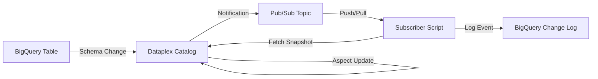

# Walkthrough: Real-time Metadata Change Capture

This solution implements an event-driven mechanism to capture and log Dataplex metadata changes into BigQuery. It enables audit trails, real-time alerts, and conversational analysis of technical and business metadata changes.

## Overview

The system monitors changes in Dataplex (schema updates, aspect changes) and automatically logs them into a central BigQuery table with a full metadata snapshot at the time of the event.



## Components

1.  **Metadata Change Feed**: A Dataplex resource that monitors metadata changes and publishes to Pub/Sub.
2.  **Pub/Sub Topic**: `dataplex-metadata-changes` handles the asynchronous event stream.
3.  **Subscriber**: `metadata_change_subscriber.py` processes messages, fetches the current state, and logs to BigQuery.
4.  **Logging Table**: `governance_export.metadata_changes` stores the event history.

## Verification Results

I have verified the system with two types of triggers:

### 1. Schema Change (Native BigQuery)
- **Action**: Added `migration_flag` column to the `customers` table.
- **Result**: Dataplex detected the schema change during harvesting and published a notification.
- **Log Entry**:
    - **Change Type**: `UPDATE`
    - **Changed Aspects**: `[".../aspectTypes/schema", "..."]`
    - **Summary**: `Metadata UPDATE for customers (Aspects: schema, storage, ...)`

### 2. Aspect Change (Dataplex Catalog)
- **Action**: Updated the `owner` field in the `data-governance-aspect` for the `customers` table.
- **Result**: Immediate notification from Dataplex.
- **Log Entry**:
    - **Change Type**: `UPDATE`
    - **Changed Aspects**: `[".../aspectTypes/data-governance-aspect"]`
    - **Snapshot**: Contains the updated `owner` value: `"owner": "Data Security Team (Updated)"`.

## How to Run

### Configuration
Ensure the `GOOGLE_CLOUD_PROJECT` environment variable is set in your terminal:
```bash
export GOOGLE_CLOUD_PROJECT="your-project-id"
```

### Setup Infrastructure
```bash
source .venv/bin/activate
python3 dataplex_integration/setup_metadata_feed.py
```

### Start the Subscriber
```bash
source .venv/bin/activate
python3 dataplex_integration/metadata_change_subscriber.py
```

### Trigger Examples
```bash
# In a separate terminal
export GOOGLE_CLOUD_PROJECT="your-project-id"
python3 dataplex_integration/trigger_schema_change.py
python3 dataplex_integration/trigger_aspect_change.py
```

### Query Results
```sql
SELECT event_timestamp, change_type, summary, metadata_snapshot 
FROM `governance_export.metadata_changes` 
ORDER BY event_timestamp DESC 
LIMIT 10;
```

## Generic Nature of the Solution

This solution is designed to be **highly generic** and resource-agnostic:
- **Universal Entry Support**: By using the `entry_name` attribute from the Pub/Sub message, it automatically captures changes for BigQuery tables, GCS files, and custom entries without any modification.
- **Dynamic Aspect Handling**: All aspects (schema, storage, lineage, custom metadata) are captured in a single `metadata_snapshot` column as JSON, making it future-proof against new metadata types.
- **Project-Level Scope**: The Dataplex Metadata Feed is configured at the project level, ensuring all activity within the project's catalog is monitored.

